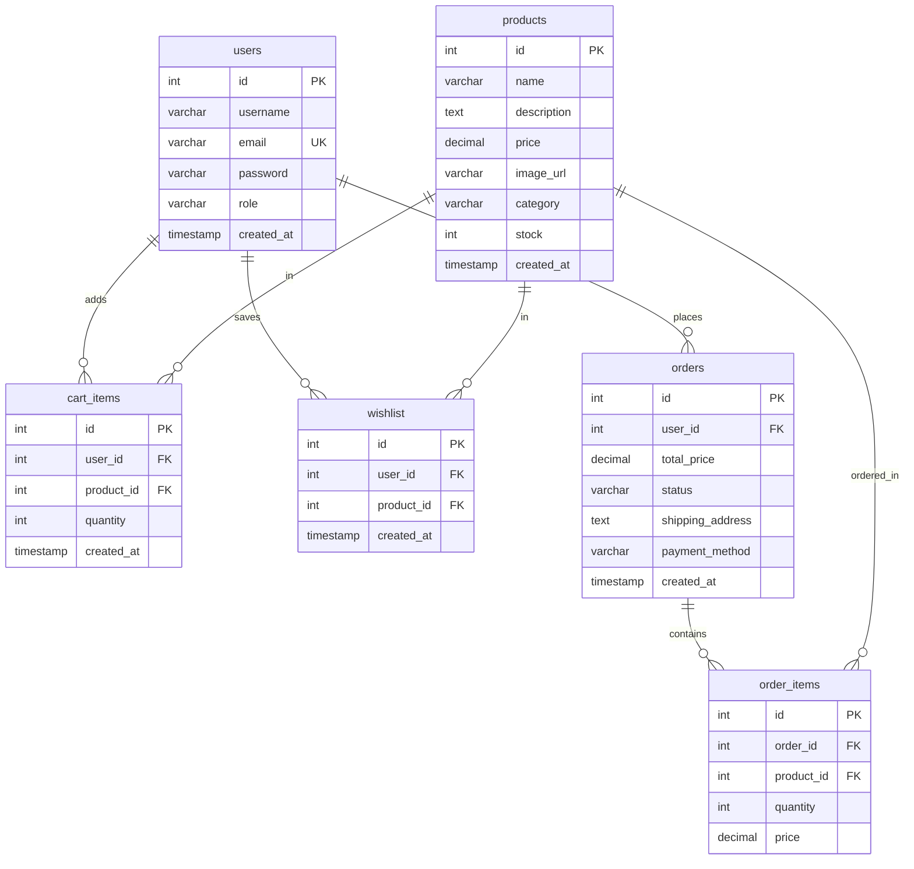
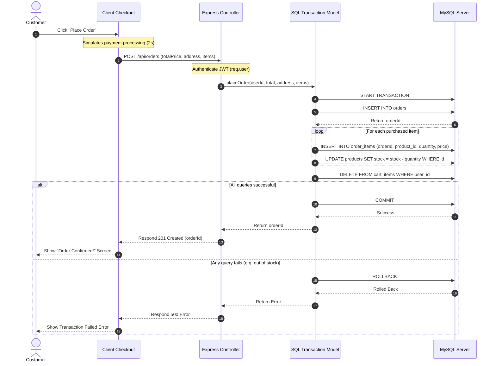

# ThiranShop Systems Architecture

This document describes the design patterns, codebase directory organization, data models, and sequence flows used to build the ThiranShop E-Commerce application.

---

## 🏗️ Architectural Overview
ThiranShop utilizes a classic **Client-Server-Database** 3-tier architecture:
1. **Presentation Tier (Frontend)**: React.js (Vite) styled with a responsive Vanilla HSL color CSS system. State is managed via specialized React Context Providers.
2. **Application Tier (Backend)**: Express.js (Node.js) acting as a REST API. Employs middleware for authentication token intercepts and error loggers.
3. **Data Tier (Database)**: MySQL database. Relies on a connection pool for scaling and atomic transactions to preserve catalog and inventory consistency.

---

## 📂 Codebase Directory Organization

```
E-Commerce-Web-Application/
├── client/
│   ├── public/
│   └── src/
│       ├── components/        # Reusable visual items (ProductCard, SearchBar, FilterComponent)
│       ├── context/           # State providers (AuthContext, CartContext, WishlistContext)
│       ├── pages/             # Route screens (Home, Shop, Details, Cart, Wishlist, Dashboard)
│       ├── services/          # API utility client (api.js instance configuration)
│       ├── styles/            # Vanilla HSL variables, components, and layout CSS files
│       ├── App.jsx            # Routing endpoints and ProtectedRoute wrapper declarations
│       └── main.jsx           # Client bundle entry point
└── server/
    ├── config/
    │   ├── db.js              # Database connection pool setup
    │   └── initDb.js          # Automation migration script
    ├── controllers/           # API request processing controllers (auth, products, orders, admin)
    ├── middleware/            # Security validation middlewares (auth, admin)
    ├── models/                # SQL queries models (user, product, cart, wishlist, order)
    ├── routes/                # Express endpoint router mappings (auth, products, cart, wishlist, orders)
    ├── utils/
    │   └── seed.js            # SQL database seeding script
    ├── app.js                 # Server configurations and mounting entry point
    └── schema.sql             # SQL table definitions
```

---

## 🗄️ Database Relationships (ER Diagram)

The following Mermaid entity-relationship diagram shows the tables structure and their foreign key constraints:



---

## 🔄 Sequence Flow: Order Checkout Transaction

This sequence diagram illustrates the transaction flow that occurs when a user checks out their cart:


